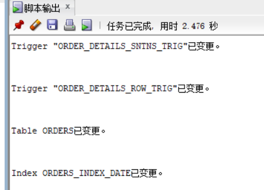
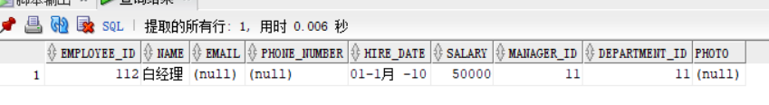
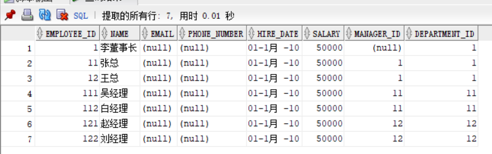
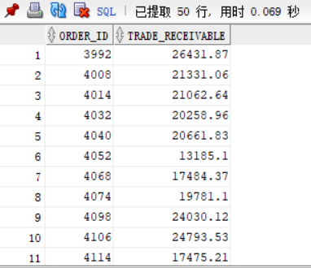
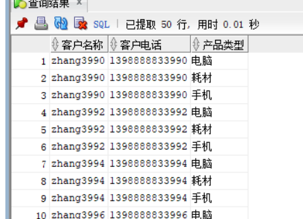
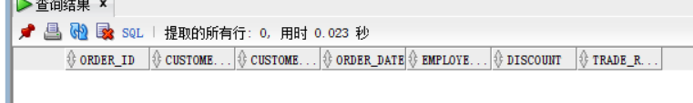
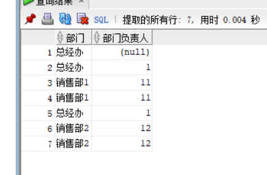
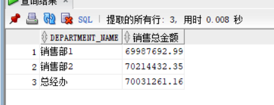

# 实验四
## 用户名：jack76

#### 1.创建表和分区并插入数据

##### 执行结果：


#### 2.查询某个员工的信息
```sql
select * from EMPLOYEES where  EMPLOYEE_ID=11;
```
##### 执行结果：


#### 3.递归查询某个员工及其所有下属，子下属员工。
```sql
WITH A (EMPLOYEE_ID,NAME,EMAIL,PHONE_NUMBER,HIRE_DATE,SALARY,MANAGER_ID,DEPARTMENT_ID) AS
(SELECT EMPLOYEE_ID,NAME,EMAIL,PHONE_NUMBER,HIRE_DATE,SALARY,MANAGER_ID,DEPARTMENT_ID
FROM EMPLOYEES WHERE employee_ID = 1
UNION ALL
SELECT B.EMPLOYEE_ID,B.NAME,B.EMAIL,B.PHONE_NUMBER,B.HIRE_DATE,B.SALARY,B.MANAGER_ID,B.DEPARTMENT_ID
FROM A, EMPLOYEES B WHERE A.EMPLOYEE_ID = B.MANAGER_ID)
SELECT * FROM A;
```
##### 执行结果：


#### 4.查询订单表，并且包括订单的订单应收货款: `Trade_Receivable= sum(订单详单表.ProductNum*订单详单表.ProductPrice)- Discount`。
```sql
SELECT
order_id,
pay-discount as Trade_Receivable
from
    (select
        orders.order_id as order_id,
        ORDERS.DISCOUNT as discount,
        sum(PRODUCT_NUM*PRODUCT_PRICE) as pay
        from ORDER_DETAILS 
        inner join ORDERS on(orders.order_id=order_details.order_id) 
        group by orders.order_id, ORDERS.DISCOUNT
);
```
##### 执行结果：


#### 5.查询订单详表，要求显示订单的客户名称和客户电话，产品类型用汉字描述。
```sql
select CUSTOMER_NAME as "客户名称",CUSTOMER_TEL as "客户电话",PRODUCT_TYPE as "产品类型"
from ORDERS o,PRODUCTS p,ORDER_DETAILS d
where o.ORDER_ID=d.ORDER_ID 
and d.PRODUCT_NAME=p.PRODUCT_NAME;
```
##### 执行结果：


#### 6.查询出所有空订单，即没有订单详单的订单。
```sql
select distinct         
ORDERS.ORDER_ID,ORDERS.CUSTOMER_NAME,
ORDERS.CUSTOMER_TEL,ORDERS.ORDER_DATE,
ORDERS.EMPLOYEE_ID,ORDERS.DISCOUNT,ORDERS.TRADE_RECEIVABLE 
from ORDERS where ORDERS.ORDER_ID not in (select ORDER_ID from ORDER_DETAILS);
```
##### 执行结果：


#### 7.查询部门表，同时显示部门的负责人姓名。
```sql
select DEPARTMENT_NAME as "部门",MANAGER_ID as "部门负责人" 
from DEPARTMENTS d,EMPLOYEES e
where d.DEPARTMENT_ID=e.DEPARTMENT_ID;
```
##### 执行结果：


####8.查询部门表，统计每个部门的销售总金额。
```sql
select DEPARTMENT_NAME,SUM(o.Trade_Receivable)AS "销售总金额"
from DEPARTMENTS d,EMPLOYEES e,ORDERS o
where d.DEPARTMENT_ID=e.DEPARTMENT_ID and e.EMPLOYEE_ID=o.EMPLOYEE_ID group by DEPARTMENT_NAME;
```
##### 执行结果：

